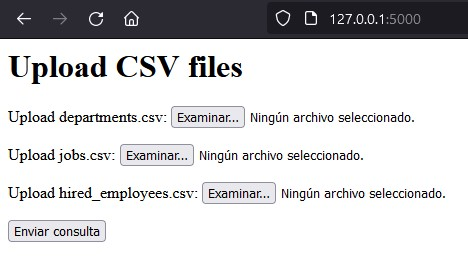
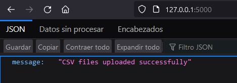
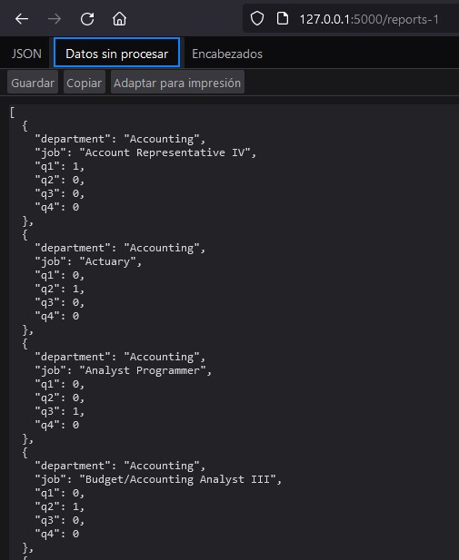
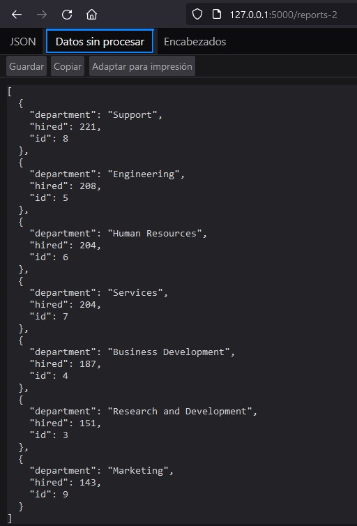

# global-de-challenge
Coding Challenge, use of APIs and endpoints for queries

# Flask Application

This is a Flask application that provides APIs for uploading CSV files and inserting data into a MySQL database.

## Features

- **Upload CSV files and insert into MYSQL database**: The `/` endpoint render an HTML where you can upload 3 CSV files ('hired_employees.csv', 'departments.csv' and 'jobs.csv'), then tha data uploaded is inserted into its respective MySQL table.
- **Reports Endpoints**: The application includes some endpoints (`/reports-1`, and `/reports-2`) that execute SQL queries on the MySQL database to retrieve some metrics related to the 'hired_employees', 'departments', and 'jobs' tables.

## Installation

1. Clone this repository.
2. Install the required Python packages: `pip install -r requirements.txt`
3. Run the Flask application: `python app.py`

## Docker

This application can be dockerized. A Dockerfile is included in the repository.

To build the Docker image, run: `docker build -t globant_de_challenge .`

To run the Docker container, run: `docker run -p 5000:5000 globant_de_challenge`

## Endpoint Usage

The URL of the REST API is [127.0.0.1:5000](http://127.0.0.1:5000/)

### First endpoint: `@app.route('/', methods=['POST'])`
In the URL bar put [127.0.0.1:5000](http://127.0.0.1:5000/) and you will get the page where you can upload the 3 CSV files ('hired_employees.csv', 'departments.csv' and 'jobs.csv').

When the CSV files are uploaded sucessfully, the endpoint returns:

### Second endpoint: `@app.route('/reports-1', methods=['GET'])`
In the URL bar put [127.0.0.1:5000/reports-1](http://127.0.0.1:5000/reports-1) and you will get the number of employees hired for each job and department in 2021 divided by quarter.

### Third endpoint: `@app.route('/reports-2', methods=['GET'])`
In the URL bar put [127.0.0.1:5000/reports-2](http://127.0.0.1:5000/reports-2) and you will get the list of department IDs, names, and the number of employees hired for each department that hired more employees than the mean in 2021.

## Testing

Automated tests for the endpoints are included in the `tests/test_app.py` file. You can run the tests using pytest: `python tests/test_app.py`

The tests include:

- Uploading CSV files for 'departments', 'jobs', and 'hired_employees' and batch inserting data into 'departments', 'jobs', and 'hired_employees'.
- Retrieving the 2 reports requested in JSON format.
